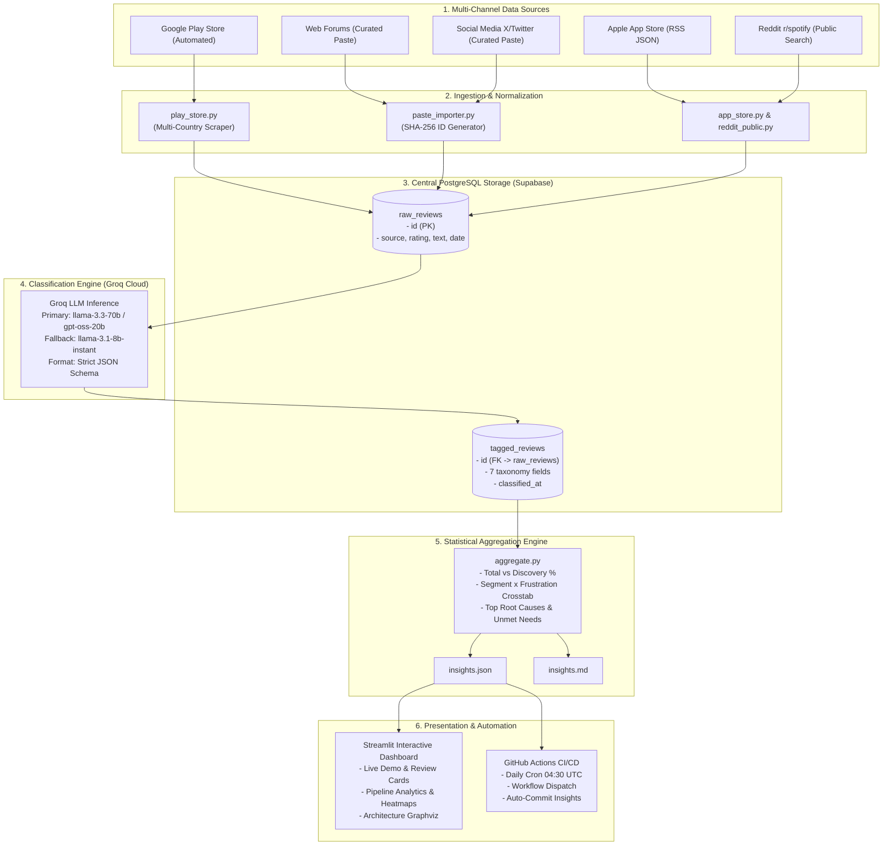

# Spotify Discovery Engine — Product & Project Manager Interview Guide

> **Role Perspective**: Growth Product Manager / Technical Project Manager  
> **Product Focus**: Spotify Discovery & Algorithmic Recommendation Retention  
> **Core Concept**: Converting qualitative multi-channel user frustration into verifiable quantitative signals to guide feature development (*Spotify Discovery Dial*).

---

## Table of Contents
1. [Executive Summary & The 30-Second Elevator Pitch](#1-executive-summary--the-30-second-elevator-pitch)
2. [The Business Problem & Strategic Context](#2-the-business-problem--the-strategic-context)
3. [Core Product & Architectural Decisions](#3-core-product--architectural-decisions)
4. [System Architecture & Data Flow (With Diagrams)](#4-system-architecture--data-flow)
5. [Pipeline Deep-Dive: Stage-by-Stage Walkthrough](#5-pipeline-deep-dive-stage-by-stage-walkthrough)
6. [The 7-Field Classification Taxonomy & AI Strategy](#6-the-7-field-classification-taxonomy--ai-strategy)
7. [Empirical Research Findings & Data-Driven Insights](#7-empirical-research-findings--data-driven-insights)
8. [Feature Translation: From Insights to the "Discovery Dial" MVP](#8-feature-translation-from-insights-to-the-discovery-dial-mvp)
9. [Technical Trade-offs, Edge Cases & Risk Management](#9-technical-trade-offs-edge-cases--risk-management)
10. [High-Frequency Interview Questions & Master PM Answers](#10-high-frequency-interview-questions--master-pm-answers)

---

## 1. Executive Summary & The 30-Second Elevator Pitch

### The 30-Second Pitch
> *"I led the development of the **Spotify Discovery Engine**, an automated AI pipeline that solves Spotify's 'repeat-listening trap.' By aggregating and classifying user reviews across 5 public channels using Groq LLM against a fixed 7-field discovery taxonomy, we turned ambiguous feedback into defensible statistical distributions. The data proved that **34.9% of user friction centers on stale recommendations and filter-bubble lock-in**, specifically impacting high-LTV **Active and Lapsed Explorers**. These insights directly justified and shaped the product requirements for the **Discovery Dial**—an AI-native novelty control feature for playlists."*

### The 2-Minute Deep Pitch
> *"Recommendation engines traditionally optimize for instant gratification—clicks, immediate skips, and passive background streams. Over time, this creates algorithmic sameness and traps users in filter bubbles. At Spotify, our high-intent explorers churn or reduce session depth when Discover Weekly and Daily Mixes become repetitive.*
>
> *To solve this, I designed a verifiable review analysis pipeline. Instead of relying on anecdotal surveys or hallucination-prone generative summaries, we built an automated pipeline that pulls reviews from Google Play Store, App Store, Reddit, forums, and social media. We normalized them into Supabase, classified each review across 7 specific taxonomy dimensions using high-throughput Groq LLM inference, and computed cross-tabulations.*
>
> *The output showed that our biggest segment friction was **Active Explorers trapped by stale recommendations (53 cross-tab instances)** with an explicit unmet need for **controllable variety**. I translated these findings into functional requirements for a deployed prototype: a playlist-level Discovery Dial with transparent, per-track AI reasoning."*

---

## 2. The Business Problem & The Strategic Context

```
Traditional Metrics (Short-Term)           The Hidden Business Risk (Long-Term)
┌─────────────────────────────────┐        ┌───────────────────────────────────┐
│ High completion rates           │        │ Passive listening fatigue         │
│ Low immediate skips             │ ───►   │ Reduced playlist saves            │
│ Predictive safe recommendations │        │ Declining exploration session depth│
└─────────────────────────────────┘        │ Churn of high-LTV power users     │
                                           └───────────────────────────────────┘
```

### The Strategic Dilemma
Spotify possesses the world's most sophisticated collaborative filtering and audio embedding engines. However:
1. **The Repeat-Listening Trap**: Algorithmic models optimize for high completion rates by replaying songs users already like.
2. **User Segment Divergence**: Passive listeners tolerate repeat tracks; **Active & Lapsed Explorers** experience acute fatigue when recommendations become predictable.
3. **The Business Cost**:
   - **Churn Driver**: Explorers migrate to YouTube Music, Bandcamp, or TikTok to find fresh artists.
   - **Lower Engagement Depth**: Repeat playlists lead to background listening where ads/promotions carry lower monetization intent and session engagement drops.

---

## 3. Core Product & Architectural Decisions

When designing this system, I established three core product principles:

| Decision | Why We Chose It | Alternative Rejected | PM Rationale |
|---|---|---|---|
| **Classification Over Retrieval (RAG)** | Every single review is tagged against a standardized taxonomy and counted mathematically. | Vector DB + Semantic RAG Summary | Executives and PMs cannot build roadmaps on qualitative summaries; we need defensible counts (*"53 users reported X"* vs *"users feel recommendations are stale"*). |
| **Deterministic Data Hygiene** | Reviews are deduplicated via source-specific IDs and SHA-256 hashes before entering the database. | Raw bulk insertion | Prevents cross-country scraping overlap from skewing statistical proportions. |
| **Zero-PII Storage** | No user names, emails, or personal identifiers stored; only review timestamp, rating, source, and text. | Full profile harvesting | Complete compliance with privacy regulations (GDPR, CCPA) and platform terms of service. |
| **Two-Tier LLM Fallback** | Primary reasoning via `llama-3.3-70b-versatile` / `openai/gpt-oss-20b`, fallback to lightweight model. | Single model with retry sleep | Ensures CI/CD pipelines and interactive Streamlit sessions never freeze during rate limits. |

---

## 4. System Architecture & Data Flow

### End-to-End System Architecture



---

## 5. Pipeline Deep-Dive: Stage-by-Stage Walkthrough

### Stage 1: Ingestion & Deduplication
- **Play Store Scraper** (`ingestion/play_store.py`): Paginates across 5 English-speaking markets (US, IN, GB, CA, AU) using `google-play-scraper`. Implements continuation tokens and date-window cutoffs (7 to 30 days).
- **Paste Importer** (`ingestion/paste_importer.py`): Parses unstructured feedback from Reddit threads, Spotify community forums, and social posts. Generates deterministic SHA-256 hashes (`hash(source + ":" + text)`) to ensure idempotent re-runs.

### Stage 2: Schema Normalization & Storage
All raw reviews are normalized to a consistent relational schema in Supabase:
- `raw_reviews(id, source, rating, review_date, text, scraped_at)`
- Foreign-key linked to `tagged_reviews(id, frustration_type, segment, desired_behavior, root_cause, unmet_need, discovery_related, sentiment, classified_at)`.

### Stage 3: High-Throughput LLM Classification
- Invokes Groq Cloud LLM with `temperature=0` and `response_format={"type": "json_object"}`.
- System prompt injects the complete taxonomy schema.
- **Defensive Parsing**: Strips markdown fences, parses token limits, and falls back to secondary fast models if token rate limits (429) or model unavailability occurs.

### Stage 4: Statistical Aggregation
- Joins `raw_reviews` and `tagged_reviews` filtered by `discovery_related = True`.
- Computes frequency rankings and two-dimensional cross-tabulations (`segment × frustration_type`).
- Serializes insights to `insights.json` for UI consumption and `insights.md` for stakeholders.

### Stage 5: Live UI & Scheduled Automation
- **Streamlit App**: Real-time review classification demo, Plotly visualizations, segment heatmaps, and Graphviz pipeline diagrams.
- **GitHub Actions**: Runs daily at 10:00 AM IST (04:30 UTC) to scrape the latest reviews, tag them, update `insights.json`, and commit changes back to GitHub.

---

## 6. The 7-Field Classification Taxonomy & AI Strategy

To avoid subjective LLM drift, every review is classified strictly across 7 defined dimensions:

```
┌────────────────────────────────────────────────────────────────────────┐
│                        CLASSIFICATION TAXONOMY                         │
├──────────────────────────┬──────────────────────┬──────────────────────┤
│ 1. frustration_type      │ 2. segment           │ 3. desired_behavior  │
├──────────────────────────┼──────────────────────┼──────────────────────┤
│ • stale_recommendations  │ • active_explorer    │ • find_new_artists   │
│ • filter_bubble_lock_in  │ • lapsed_explorer    │ • break_routine      │
│ • discovery_friction     │ • passive_listener   │ • match_mood_context │
│ • algorithmic_sameness   │ • genre_loyalist     │ • deep_dive_genre    │
│ • poor_new_release_surfacing│ • mood_listener   │ • social_discovery   │
│ • context_blindness      │ • podcast_first      │ • rediscover_catalog │
│ • over_personalization   │ • unknown            │ • none               │
│ • control_loss           │                      │                      │
│ • none                   │                      │                      │
├──────────────────────────┴──────────────────────┴──────────────────────┤
│ 4. root_cause        : Concise explanation (<= 12 words)                │
│ 5. unmet_need        : Explicit user requirement (<= 12 words)         │
│ 6. discovery_related : Boolean flag (true / false)                     │
│ 7. sentiment         : positive / neutral / negative                   │
└────────────────────────────────────────────────────────────────────────┘
```

### Prompt Engineering & Guardrails
- **Zero Temperature**: Enforces deterministic, repeatable tagging across runs.
- **Strict JSON Mode**: Prevents conversational filler and conversational hallucinations.
- **Word Constraints**: Forces root causes and unmet needs into concise phrases (<= 12 words), making them groupable and quantifiable.

---

## 7. Empirical Research Findings & Data-Driven Insights

From our initial baseline run of **456 multi-source reviews**:

### 1. High-Level Distribution
- **Total Reviews**: 456
- **Discovery-Related**: **159 reviews (34.9%)**
- **Non-Discovery Reviews**: 297 (Bugs, billing, UI complaints, podcast layout)

### 2. The Core Crosstab Signal (The "Aha!" Metric)
The cross-tabulation between User Segment and Frustration Type pinpointed the exact user pain:

```
SEGMENT × FRUSTRATION CROSSTAB (Ranked)
┌──────────────────┬─────────────────────────────┬───────────┐
│ Segment          │ Frustration Type            │ Mentions  │
├──────────────────┼─────────────────────────────┼───────────┤
│ active_explorer  │ stale_recommendations       │    53     │◄── Dominant Pain Point
│ active_explorer  │ control_loss                │    22     │◄── Lack of Agency
│ active_explorer  │ discovery_friction          │    15     │
│ lapsed_explorer  │ stale_recommendations       │    11     │
│ active_explorer  │ context_blindness           │     4     │
│ active_explorer  │ filter_bubble_lock_in       │     4     │
│ podcast_first    │ control_loss                │     6     │
└──────────────────┴─────────────────────────────┴───────────┘
```

### 3. Top Unmet Needs & Root Causes
- **Top Unmet Need**: *"New music / unfamiliar artists"* (36 mentions), *"Music variety"* (12 mentions).
- **Top Root Cause**: *"Recommendations repeat songs from library/daily mixes"* (20 mentions), *"Lack of steering control"* (20 mentions).

---

## 8. Feature Translation: From Insights to the "Discovery Dial" MVP

A great PM connects data directly to product execution. Here is how our findings translated into product specs:

```
Quantitative Insight                User Frustration                     Product Feature Spec
┌───────────────────────────┐       ┌────────────────────────────┐       ┌───────────────────────────────┐
│ 53 mentions:              │ ────► │ "I'm tired of hearing the  │ ────► │ Discovery Dial (Slider: 0-100)│
│ active_explorer +         │       │ same familiar songs in my  │       │ Controls novelty threshold in │
│ stale_recommendations     │       │ mixes every day."          │       │ any playlist.                 │
└───────────────────────────┘       └────────────────────────────┘       └───────────────────────────────┘
┌───────────────────────────┐       ┌────────────────────────────┐       ┌───────────────────────────────┐
│ 22 mentions:              │ ────► │ "Spotify forces tracks on  │ ────► │ Transparent AI Reasoning      │
│ active_explorer +         │       │ me and I don't know why    │       │ Per-track badge explaining why│
│ control_loss              │       │ they were picked."         │       │ the track matches intent.     │
└───────────────────────────┘       └────────────────────────────┘       └───────────────────────────────┘
```

### Discovery Dial Prototype Architecture (Companion MVP)
- **Tech Stack**: React 18, Vite, Tailwind CSS, Groq API.
- **User Experience**:
  1. User selects a playlist (e.g., "Indie Chill").
  2. Sets the **Discovery Dial**:
     - *0% (Familiar)*: 90% library favorites, 10% similar artists.
     - *50% (Balanced)*: 50% known tracks, 50% adjacent discoveries.
     - *100% (Wild Explorer)*: 100% unfamiliar artists, niche genres, underground releases.
  3. **Explainable AI**: Click any track to see Groq's micro-reasoning (*"Recommended because you like Phoebe Bridgers' acoustic tempo, but featuring an emerging Dublin indie artist"*).

---

## 9. Technical Trade-offs, Edge Cases & Risk Management

### 1. Handling API Rate Limits & Token Caps
- **Issue**: Groq free/standard tier has strict per-minute token limits on large 70B models.
- **PM Mitigation**: Built an automatic fallback hierarchy in `backend.py`. If `llama-3.3-70b` hits a 429 or token limit, it falls back to `openai/gpt-oss-20b` or `llama-3.1-8b-instant` without crashing the user session.

### 2. Guarding Against LLM Hallucinations
- **Issue**: LLMs given open prompts invent custom frustration tags (*e.g., "boring_songs"*), breaking SQL aggregation.
- **PM Mitigation**: Hardcoded enum checks in `init_db.sql` and Pydantic-style prompt constraints. Any invalid tag is rejected by database check constraints.

### 3. Asynchronous Pipeline UI Tracking
- **Issue**: Triggering GitHub Actions from Streamlit can result in browser timeouts.
- **PM Mitigation**: Designed an asynchronous polling mechanism in Streamlit session state that polls the GitHub Actions REST API every 8 seconds, showing animated progress stages (Ingestion → Classification → Aggregation → Ready).

---

## 10. High-Frequency Interview Questions & Master PM Answers

### Q1: "Why build a custom classification pipeline instead of just prompting ChatGPT with all reviews?"
> **Master Answer**:  
> *"Prompting a general LLM with a 10,000-word review dump leads to recency bias, hallucinated summaries, and an inability to track trends over time. As a PM, I cannot prioritize engineering sprints based on 'users seem unhappy with recommendations.'  
> By structuring reviews into a fixed relational schema and tagging each one deterministically, we produce auditable metrics: '34.9% of friction is discovery-related, and 53 Active Explorers specifically cite stale recommendations.' This allows us to track whether our feature releases actually decrease that metric month-over-month."*

### Q2: "How did you validate that your 7-field taxonomy was accurate?"
> **Master Answer**:  
> *"We started with exploratory clustering on an initial sample of 50 reviews to identify natural friction clusters (sameness, bubble lock-in, context mismatch). We then established the 7-field taxonomy with unambiguous definitions and tested it on edge cases (e.g., reviews mentioning bugs vs. recommendation complaints).  
> In production, reviews that don't fit discovery are classified as `frustration_type: none` and filtered out during aggregation, preserving high data purity."*

### Q3: "How would you measure the success of the Discovery Dial once deployed to production?"
> **Master Answer**:  
> *"I would structure success across three levels:*
> 1. **North Star Metric**: *Monthly Discovery Depth* (number of unfamiliar tracks saved to library or re-streamed within 14 days).
> 2. **Feature Engagement**: % of Daily Mix listeners who interact with the Discovery Dial; distribution of dial positions (validating whether users want 20%, 50%, or 80% novelty).
> 3. **Guardrail Metric**: Skip rate within the first 30 seconds (ensuring high novelty does not cause immediate drop-off) and 30-day subscriber churn among the Explorer cohort."*

### Q4: "What would you build next in V2?"
> **Master Answer**:  
> *"In V2, I would close the loop between user reviews and the recommendation algorithm:
> 1. **In-App Intent Feedback**: Add a 1-tap 'Too Familiar' vs 'Too Weird' button directly on the Spotify player.
> 2. **Dynamic Context Steering**: Feed real-time contextual signals (time of day, weather, commute status) into the LLM classifier to address the 8 reviews citing 'context blindness.'
> 3. **Automated Alerting**: Trigger Slack alerts to the recommendation ML team whenever 'stale_recommendations' spikes above 40% of weekly feedback."*
